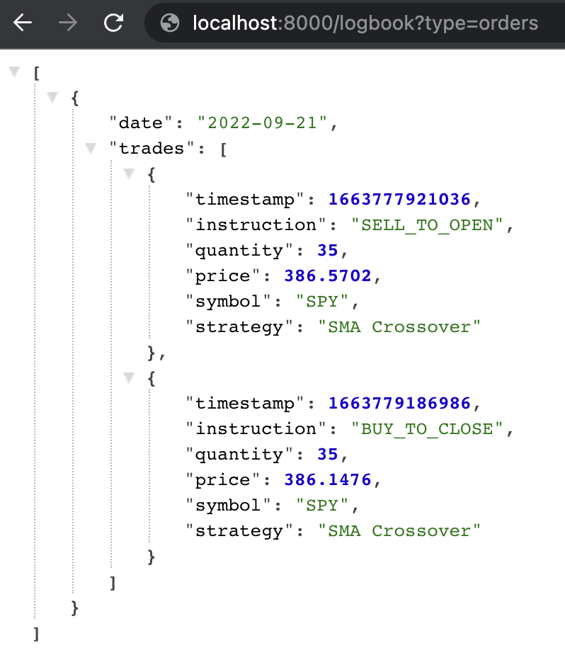
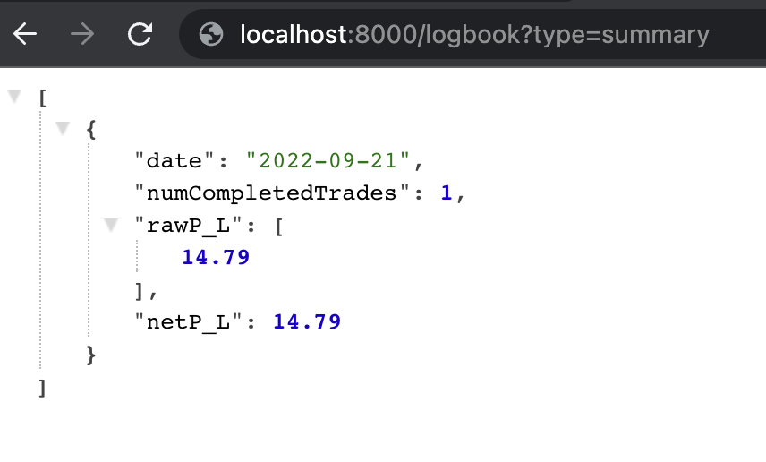

# tos-algo-trade

Simple Express server that helps automate Buy and Sell stock orders through Thinkorswim API.

This programs exposes API endpoints where you can send a POST request to Buy or Sell stocks for Thinkorswim. It does not decide what/when to Buy or Sell. You need to find a Signal Provider, or write your own program to send a POST request to this server to execute the trade.

# Features

1. Buy and Sell Stocks automatically
2. Log all trades to a Logbook to be viewed easily
3. Automatically close all open trades at 15:50 New York Time each day
4. Send trade summary to a Telegram group of your choice each day at 15:50

# Limitations

1. Only market buy and market sell of Stocks are supported and tested. Limit orders are not added in this version.
2. Options trades may not function properly. Use at your own risk.
3. Only orders with 1 leg will be supported.
4. For short trading days, automaticatic closing of trades at 15:50 hr will not work.

# Setup
1. Clone this project
2. Run `npm install` on root folder of project
3. Create a file `.env` in root folder of project, using the template below. This will contain all your credentials.
4. Run `npm run dev` during development. Run `npm run start` for production. To stop production, run `npm run stop`.

`.env` Template:

```bash
PORT=8000
AUTH=enter_some_string_here_of_your_choice
REFRESH_TOKEN=your_refresh_token_here
CONSUMER_KEY=your_consumer_key_without_@AMER.OAUTHAP
ACCOUNT_ID=nine_digits_thinkorswim_account_id
TELEGRAM_TOKEN=your_telegram_token_to_send_the_bot_msg_from
TELEGRAM_CHAT_ID=your_telegram_chat_id_to_send_bot_msg_to
```

For how to get your Refresh Token, Consumer Key and Account Id, please look at the official [docs](https://developer.tdameritrade.com/authentication/apis/post/token-0) from TD Ameritrade. Note: You do not need to input Access Token, as it will be automatically fetched with your Refresh Token.

# API Endpoints

* [/market_buy](#post-market_buy)
* [/market_sell](#post-market_sell)
* [/market_order](#post-market_order)
* [/market_close_all](#post-market_close_all)
* [/add_unavailable_date](#post-add_unavailable_date)
* [/logbook](#get-logbook)
* [/config](#get-config)
* [/stop](#get-stop)
* [/start](#get-start)

In general, for all `POST` endpoints, you will need to send a field `auth` that corresponds to the AUTH in `.env` file. This will then authenticate you and allow the endpoints to pass. `GET` endpoints do not require this `auth` fields as these endpoints are generally safe.

In Buy and Sell order, there is this concept of `strategy`. In short, `strategy` is a name you give to identify the order, so that different strategies can purchase the same ticker. For example, if you send a Buy order with the strategy name `strategy1` to buy 10 SPY, subsequently if you send another Buy order with strategy name `strategy1` again to buy 10 SPY, the buy order will do nothing. But if you send the Buy order with another strategy name, such as `strategy2`, then the Buy order will go through and allows you to manage 2 different Buy positions. When you want to link a Sell order to a Buy order, or vice versa, use the same strategy name, otherwise they will be treated as 2 different positions.

</br>

### POST /market_buy
 * Send a POST request to put in a Market Buy Order for a particular ticker.
 * If there is already an opened Short order for this strategy that is not closed yet, we will proceed to close that instead.
 * If there is already an opened Long order for this strategy, then do nothing.

```bash
curl -X POST -H "Content-Type: application/json" -d '{"auth": "MY_SOME_AUTH", "symbol": "SPY", "quantity": 1, "strategy": "My Strategy Name"}' http://localhost:8000/market_buy
```


<table>
<tr>
<td> </td> <td> Signature </td> <td> Explanation </td>
</tr>
<tr>
<td> Request Body </td>
<td>

```ts
{
  auth: string,
  symbol: string,
  quantity: number,
  strategy: string,
}
```

</td>
<td> 


```
auth: The same string found in `.env` AUTH
symbol: The ticker to buy, e.g. 'SPY'
quantity: The amount to buy, e.g. 10
strategy: A string name of your choice
```

</td>
</tr>
<tr>
<td> Response Body </td>
<td> Status: 200 | 422 | 503 </td>
<td> 


```
Succeeds: 200 "market_buy finishes!"
Failed to pass in 'symbol' or 'quantity' or 'strategy': 422 "Wrong body format"
Error: 503 "Server error"
```

</td>
</tr>
</table>


</br>

### POST /market_sell
 * Send a POST request to put in a Market Sell Order for a particular ticker.
 * If there is already an opened Long order for this strategy that is not closed yet, we will proceed to close that instead.
 * If there is already an opened Short order for this strategy, then do nothing.

```bash
curl -X POST -H "Content-Type: application/json" -d '{"auth": "MY_SOME_AUTH", "symbol": "SPY", "quantity": 1, "strategy": "My Strategy Name"}' http://localhost:8000/market_sell
```

<table>
<tr>
<td> </td> <td> Signature </td> <td> Explanation </td>
</tr>
<tr>
<td> Request Body </td>
<td>

```ts
{
  auth: string,
  symbol: string,
  quantity: number,
  strategy: string,
}
```

</td>
<td> 


```
auth: The same string found in `.env` AUTH
symbol: The ticker to sell, e.g. 'SPY'
quantity: The amount to sell, e.g. 10
strategy: A string name of your choice
```

</td>
</tr>
<tr>
<td> Response Body </td>
<td> Status: 200 | 422 | 503 </td>
<td> 


```
Succeeds: 200 "market_sell finishes!"
Failed to pass in 'symbol' or 'quantity' or 'strategy': 422 "Wrong body format"
Error: 503 "Server error"
```

</td>
</tr>
</table>

</br>

### POST /market_order
 * Send a POST request to put in a Market Buy or Market Sell Order for a particular ticker.
 * This is the same as calling /market_buy or /market_sell, except we instruct the buy or sell action through the body request.
 *
 * If we send in a Market Buy and there is already an opened Short order for this strategy that is not closed yet, we will proceed to close that instead.
 * If we send in a Market Buy and there is already an opened Long order for this strategy that is not closed yet, do nothing.
 * If we send in a Market Sell and there is already an opened Long order for this strategy that is not closed yet, we will proceed to close that instead.
 * If we send in a Market Sell and there is already an opened Short order for this strategy that is not closed yet, do nothing.

```bash
curl -X POST -H "Content-Type: application/json" -d '{"auth": "MY_SOME_AUTH", "symbol": "SPY", "quantity": 1, "strategy": "My Strategy Name", "action": "buy"}' http://localhost:8000/market_order
```

<table>
<tr>
<td> </td> <td> Signature </td> <td> Explanation </td>
</tr>
<tr>
<td> Request Body </td>
<td>

```ts
{
  auth: string,
  symbol: string,
  quantity: number,
  strategy: string,
  action: "buy" | "sell"
}
```

</td>
<td> 


```
auth: The same string found in `.env` AUTH
symbol: The ticker to sell, e.g. 'SPY'
quantity: The amount to sell, e.g. 10
strategy: A string name of your choice
action: "buy" if we want to execute /market_buy, "sell" if we want to execute /market_sell
```

</td>
</tr>
<tr>
<td> Response Body </td>
<td> Status: 200 | 422 | 503 </td>
<td> 


```
Succeeds: 200 "market_order for {buy|sell} finishes!"
Failed to pass in 'symbol' or 'quantity' or 'strategy' or 'action': 422 "Wrong body format"
Error: 503 "Server error"
```

</td>
</tr>
</table>

</br>

### POST /market_close_all
 * Send a POST request to close all existing open orders, if any, for all strategies.
 * If there is no open orders, do nothing.

```bash
curl -X POST -H "Content-Type: application/json" -d '{"auth": "MY_SOME_AUTH"}' http://localhost:8000/market_close_all
```

<table>
<tr>
<td> </td> <td> Signature </td> <td> Explanation </td>
</tr>
<tr>
<td> Request Body </td>
<td>

```ts
{
  auth: string,
}
```

</td>
<td> 


```
auth: The same string found in `.env` AUTH
```

</td>
</tr>
<tr>
<td> Response Body </td>
<td> Status: 200 | 503 </td>
<td> 


```
Succeeds: 200 "Closed all open orders successfully."
Error: 503 "Server error"
```

</td>
</tr>
</table>

</br>

### POST /add_unavailable_date
 * Send a POST request to add an unavailable date to trade, so the app will not trade on that particular date.
 * The format of the unavailable_date must be YYYY-MM-YY, in New York time. e.g. "2022-09-03".

```bash
curl -X POST -H "Content-Type: application/json" -d '{"auth": "MY_SOME_AUTH", "unavailable_date": "2022-09-03" }' http://localhost:8000/add_unavailable_date
```

<table>
<tr>
<td> </td> <td> Signature </td> <td> Explanation </td>
</tr>
<tr>
<td> Request Body </td>
<td>

```ts
{
  auth: string,
  unavailable_date: string
}
```

</td>
<td> 


```
auth: The same string found in `.env` AUTH
unavailable_date: A string in the format `YYYY-MM-YY` referencing New York Time.
```

</td>
</tr>
<tr>
<td> Response Body </td>
<td> Status: 200 | 422 | 503 </td>
<td> 


```
Succeeds: 200 "Added unavailable_date successfully."
Failed to pass in 'unavailable_date': 422 "Wrong body format"
Error: 503 "Server error"
```

</td>
</tr>
</table>

</br>

### GET /logbook
 * Get the logbook information.
 * If date query is specified, retrive information on that particular date.
 * If week query is specified, retrieve information on that particular week.
 * Otherwise, retrieve all information to date.
 * Priority: date > week > all

```
http://localhost:8000/logbook?type=orders
http://localhost:8000/logbook?type=orders&date=2022-09-19
http://localhost:8000/logbook?type=summary&week=2022-09-w3
```





<table>
<tr>
<td> </td> <td> Signature </td> <td> Explanation </td>
</tr>
<tr>
<td> Request Body </td>
<td>

```ts
{
  type: 'error' | 'summary' | 'orders'
  date?: string,
  week?: string,
}
```

</td>
<td> 


```
type: 'error' to get the logbbok of Errors, 'summary' to get the Summary, and 'orders' to get the orders.
date: A string in the format `YYYY-MM-YY` referencing New York Time. E.g. `2022-12-13`
week: A string in the format `YYYY-MM-W{n}` referencing New York Time. E.g. `2022-09-w3` to get all trandes from Sept 15th-21th.
```

</td>
</tr>
<tr>
<td> Response Body </td>
<td> Status: 200 | 503 </td>
<td> 


```
Succeeds: 200 and return the respective data
Error: 503 "Server error"
```

</td>
</tr>
</table>

</br>

### GET /config
 * View the Config object in disk.

```bash
http://localhost:8000/config
```

</br>

### GET /stop
 * A kill switch to quickly stop all trading. The bot will not executed anymore trades after this API is made.

```bash
http://localhost:8000/stop
```

</br>

### GET /start
 * Resume the kill switch done in /stop. The bot will continue to execute trades.

```bash
http://localhost:8000/start
```

# Credits
We use the following open source library to make this app possible:

1. [Sainglend/tda-api-client](https://github.com/Sainglend/tda-api-client)
2. [axios/axios](https://github.com/axios/axios)
3. [iamkun/dayjs](https://github.com/iamkun/dayjs/)
4. [motdola/dotenv](https://github.com/motdotla/dotenv)
5. [expressjs/express](https://github.com/expressjs/express)
6. [node-cron/node-cron](https://github.com/node-cron/node-cron)
7. [Unitech/pm2](https://github.com/Unitech/pm2)

# License and Disclaimer

```
ISC License

Copyright <YEAR> <OWNER>

Permission to use, copy, modify, and/or distribute this software for any purpose with or without fee is hereby granted, provided that the above copyright notice and this permission notice appear in all copies.

THE SOFTWARE IS PROVIDED "AS IS" AND THE AUTHOR DISCLAIMS ALL WARRANTIES WITH REGARD TO THIS SOFTWARE INCLUDING ALL IMPLIED WARRANTIES OF MERCHANTABILITY AND FITNESS. IN NO EVENT SHALL THE AUTHOR BE LIABLE FOR ANY SPECIAL, DIRECT, INDIRECT, OR CONSEQUENTIAL DAMAGES OR ANY DAMAGES WHATSOEVER RESULTING FROM LOSS OF USE, DATA OR PROFITS, WHETHER IN AN ACTION OF CONTRACT, NEGLIGENCE OR OTHER TORTIOUS ACTION, ARISING OUT OF OR IN CONNECTION WITH THE USE OR PERFORMANCE OF THIS SOFTWARE.
```

I do not provide personal investment advice and I am not a qualified licensed investment/financial advisor. The use of this software, as well as any interactions with me or comments made by me, whether in private or public, should not constitute financial advice or trading advice. Automated trading programs carry a particularly high risk due to their ungoverned nature. Any losses or gains made with one or more of these programs is your own responsibility. We takes no responsibility for any losses incurred or any malfunctions of the software on your account. Money lost by this program will not be refunded, as we are not liable for the transactions made in your accounts. As you are required to store your credentials for this program to execute trades, you are liable to the security of such credentials and will store these credentials in a safe and secure environment. Any lost of credentials due to the usage/attempt usage of this software will be your sole responsibility and we take no responsibility.
